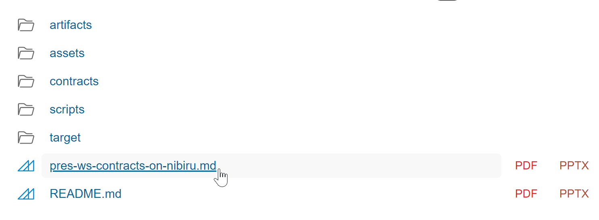

# @nibiruchain/00-smart-contract-kickstart

Run `just` to see list out all of the available commands.

### To run the tutorial

Open the slides:

```
just slides
```

Then, open the localhost endpoint and select the presentation:

> "[ INFO ] [Server mode] Start server listened at http://localhost:8080/ ..."


