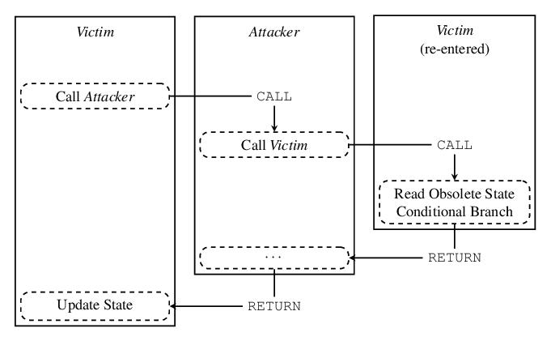

# Nibiru Chain: Technical Workshop

<!-- class: invert -->


<!-- Changes background of the first slide. -->

---

**Rust** is the programming language used to create smart contracts for the Nibiru
blockchain. 

1. A statically typed, compiled language with capabilities for embedded systems
2. Memory safe without garbage collection through the "borrow"-checker system.
3. Blazingly fast

---

## CosmWasm smart Contracts

- Contracts are Rust crates
- Workshop: Walk through a simple contract, end-to-end

## CosmWasm Benefits

1. Security guarantees from the "Actor Model": Isolated State + Sequential
   Message Processing
2. Perform and safety guarantees of Wasm VM
3. Benefit from advancements in Rust tooling

---

## No need to design around reentrancy



---

## Install Rust

```bash
curl --proto '=https' --tlsv1.2 -sSf https://sh.rustup.rs | sh
```

Installing Rust using `rustup` will also install `cargo`, which is used to:

1. Build and run Rust programs
2. Run tests
3. Manage crate depencencies. 
4. Publish crates

Learn more in [The Cargo Book](https://doc.rust-lang.org/cargo/getting-started/first-steps.html).

---

## We'll use `just` (justfile) instead of `make` (Makefile) because it's better.

1. 
    ```bash
    cargo install just
    ```
2. Then, run `just` in the repo to see some documentation on each command.

---

## Install Dependencies

```bash 
just install
```

--- 

## Install Dependencies

```bash 
just install
```

Under the hood, this will run the following commands automatically.

```bash
# Install WebAssembly target
rustup target add wasm32-unknown-unknown
```

```bash
# Download `nibid` and `pricefeeder`
curl -s https://get.nibiru.fi/! | bash
curl -s https://get.nibiru.fi/pricefeeder! | bash
```

---

## Setup keys

```bash
just setup-env
just add-key
# nibid keys list 
```

```json
  {
    "name": "test-me",
    "type": "local",
    "address": "nibi1zaavvzxez0elundtn32qnk9lkm8kmcsz44g7xl",
    "pubkey": "{\"@type\":\"/cosmos.crypto.secp256k1.PubKey\",\"key\":\"AvzwBOriY8sVwEXrXf1gXanhT9imlfWeUWLQ8pMxrRsg\"}"
  }
```

--- 

## Compiling contracts

```bash
just wasm-all
```

- Just requires `docker`
- This command will compile all smart contracts in the workspace.


---

## Run a local Nibiru Network

```bash
just run-nibiru
# This runs `nibid start`
```

What happens?
- Chain running with a single validator node
- The mnemonic to use this account is known
- The account is bootstrapped with large amounts of funds

--- 

## Wasm commands on the `nibid` CLI

```bash
nibid tx wasm --help
```

- `nibid tx wasm store`: Deploy wasm bytecode to chain's [store].
- `nibid tx wasm inst` : [Inst]antiate contract
- `nibid tx wasm execute`: [Execute] transaction by invoking a contract 

---

## Wasm Commands [1]: Deploy

```bash
nibid tx wasm store $WASM --from $KEY_NAME --gas=2500000  \
  --fees=1$NIBI | jq > store_resp.json
```

```bash
WASM="artifacts/todolist.wasm"
KEY_NAME="test-me"
local MNEM="..." 
echo "$MNEM" | nibid keys add $KEY_NAME --recover --keyring-backend test
```

<!-- local MNEM="guard cream sadness conduct invite crumble clock pudding hole grit liar hotel maid produce squeeze return argue turtle know drive eight casino maze host"  -->

---

## Wasm Commands [2]: Insantiate

```bash
# template
nibid tx wasm inst [code-id] [inst-msg-json] --label="..." --no-admin
--from="$KEY_NAME" | jq > inst.json
```

```bash
nibid tx wasm inst 1 "{}" --label="todo list contract" --no-admin
--from="$KEY_NAME" | jq > inst.json
```

Then, grab your contract address from `inst.json`.
```bash
CONTRACT="nibi14hj2tavq8fpesdwxxcu44rty3hh90vhujrvcmstl4zr3txmfvw9ssa9gcs"
```

---

## Wasm Commands [3]: Execute

```bash
nibid tx wasm execute $CONTRACT "$(cat exec_add.json)" \
  --from="$KEY_NAME" --gas=8000000 --fees=200000unibi \ 
  -y | jq > out0.json
```

```rust
pub enum ExecuteMsg {
    Add { task: String },
    Toggle { task_id: u64 },
    Delete { task_id: u64 },
}
```

```json
# exec_add.json
{ "add": { "task": "Do 100 LeetCode practice problems" } }
```

--- 

## Wasm Commands [4]: Queries

```bash
nibid q wasm contract contract-smart smart [contract_bech32] [query_json]
```

```rust
#[derive(cosmwasm_schema::QueryResponses)]
pub enum QueryMsg {
    /// Fetches all of the tasks
    #[returns(Vec<TodoTask>)]
    Todos {},

    /// Fetch single task with the given ID.
    #[returns(TodoTask)]
    TodoTask { id: u64 },

    /// Fetch all tasks marked as done after the given `since_id`.
    #[returns(Vec<TodoTask>)]
    CompletedTasks { since_id: Option<u64> },
}
```

---

## Wasm Commands [5]: Queries

```bash
# nibid q wasm contract contract-smart smart [contract_bech32] [query_json]
nibid q wasm contract-state smart $CONTRACT '{ "todos": {} }'
```

```rust
#[derive(cosmwasm_schema::QueryResponses)]
pub enum QueryMsg {
    /// Fetches all of the tasks
    #[returns(Vec<TodoTask>)]
    Todos {},

    /// Fetch single task with the given ID.
    #[returns(TodoTask)]
    TodoTask { id: u64 },

    /// Fetch all tasks marked as done after the given `since_id`.
    #[returns(Vec<TodoTask>)]
    CompletedTasks { since_id: Option<u64> },
}
```

---

# Appendix

---

## Appendix [1]

Instructions to install Go:
https://go.dev/doc/install

https://get.nibiru.fi/
https://get.nibiru.fi/pricefeeder

https://get.nibiru.fi/?type=script
https://get.nibiru.fi/pricefeeder?type=script


---

## Appendix [2]

Formatting and Linting

```bash
just tidy
```

